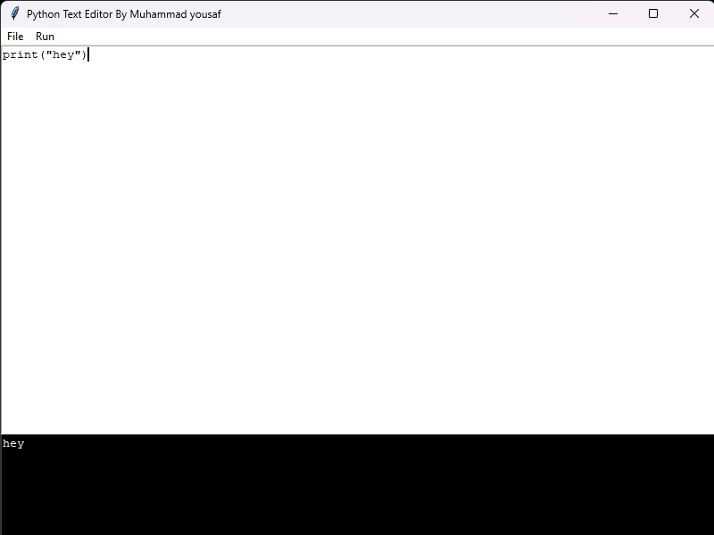

# Python Text Editor with Integrated Python Compiler and Terminal

## Overview

This program is a GUI-based text editor with an integrated Python compiler and terminal. It allows users to write, edit, save, and run Python scripts within a single application. .

Author
This program is written by Muhammad Yousaf. 
Email: yousafsahiwal3@gmail.com

## Features

1. **Text Editor**:
    - Create, open, save, and edit text files.
    - Supports undo functionality.
    
2. **Python Compiler**:
    - Runs Python scripts and displays the output in an integrated terminal.
    
3. **Terminal**:
    - Displays the output of the executed Python script.
    
## Prerequisites

- Python 3.x
- Tkinter library (usually included with Python installations)
- `subprocess` and `os` modules (standard Python libraries)

## How to Use

1. **Clone or Download the Repository**:
    ```bash
    git clone <repository-url>
    ```
    Alternatively, you can download the ZIP file and extract it.

2. **Run the Script**:
    Navigate to the directory where the script is located and run:
    ```bash
    python text_editor.py
    ```

3. **Using the Text Editor**:
    - **New File**: Create a new file by selecting `File > New`.
    - **Open File**: Open an existing file by selecting `File > Open`.
    - **Save File**: Save the current file by selecting `File > Save`.
    - **Save As**: Save the current file with a new name by selecting `File > Save As`.
    - **Exit**: Exit the application by selecting `File > Exit`.
    - **Run Code**: Run the current Python script by selecting `Run > Run`.

## Code Explanation

```python
#this program is written by muhammad yousaf Email:yousafsahiwal3@gmail.com
import subprocess
import os
import tkinter as tk
from tkinter import filedialog, messagebox

class TextEditor:

    def __init__(self, root):
        
        self.root = root
        self.root.title("Python Text Editor By Muhammad yousaf")
        self.root.geometry("800x600")

        self.filename = None

        self.text_area = tk.Text(self.root, wrap="word", undo=True)
        self.text_area.pack(expand=1, fill="both")

        self.create_menu()
        self.create_terminal()

    def create_menu(self):
        menubar = tk.Menu(self.root)
        self.root.config(menu=menubar)

        file_menu = tk.Menu(menubar, tearoff=0)
        file_menu.add_command(label="New", command=self.new_file)
        file_menu.add_command(label="Open", command=self.open_file)
        file_menu.add_command(label="Save", command=self.save_file)
        file_menu.add_command(label="Save As...", command=self.save_as_file)
        file_menu.add_separator()
        file_menu.add_command(label="Exit", command=self.exit_editor)
        menubar.add_cascade(label="File", menu=file_menu)

        run_menu = tk.Menu(menubar, tearoff=0)
        run_menu.add_command(label="Run", command=self.run_code)
        menubar.add_cascade(label="Run", menu=run_menu)

    def create_terminal(self):
        self.terminal_frame = tk.Frame(self.root)
        self.terminal_frame.pack(fill="x", side="bottom")

        self.terminal_text = tk.Text(self.terminal_frame, height=10, wrap="word", bg="black", fg="white")
        self.terminal_text.pack(expand=1, fill="both")

    def new_file(self):
        self.filename = None
        self.text_area.delete(1.0, tk.END)

    def open_file(self):
        self.filename = filedialog.askopenfilename(defaultextension=".py", filetypes=[("Python Files", "*.py"), ("All Files", "*.*")])
        if self.filename:
            with open(self.filename, "r") as file:
                self.text_area.delete(1.0, tk.END)
                self.text_area.insert(1.0, file.read())

    def save_file(self):
        if self.filename:
            with open(self.filename, "w") as file:
                file.write(self.text_area.get(1.0, tk.END))
        else:
            self.save_as_file()

    def save_as_file(self):
        self.filename = filedialog.asksaveasfilename(defaultextension=".py", filetypes=[("Python Files", "*.py"), ("All Files", "*.*")])
        if self.filename:
            with open(self.filename, "w") as file:
                file.write(self.text_area.get(1.0, tk.END))

    def exit_editor(self):
        self.root.quit()

    def run_code(self):
        if not self.filename:
            messagebox.showerror("Save your file", "Please save your code before running.")
            return

        self.save_file()

        self.terminal_text.delete(1.0, tk.END)
        try:
            result = subprocess.run(["python", self.filename], capture_output=True, text=True, shell=True)
            self.terminal_text.insert(1.0, result.stdout + result.stderr)
        except Exception as e:
            self.terminal_text.insert(1.0, str(e))

if __name__ == "__main__":
    screen = tk.Tk()
    editor = TextEditor(screen)
    screen.mainloop()

```

## Output

When you run the script and interact with the GUI, you will see the following:

- A window titled "Python Text Editor By Muhammad yousaf".
- A text area where you can write and edit Python scripts.
- A terminal at the bottom of the window to display the output of the executed Python script.

### Example Screenshots

#### 1. Initial Text Editor Window


Feel free to customize and extend this program to suit your needs. If you have any questions or need further assistance, please contact me at yousafsahiwal3@gmail.com.
